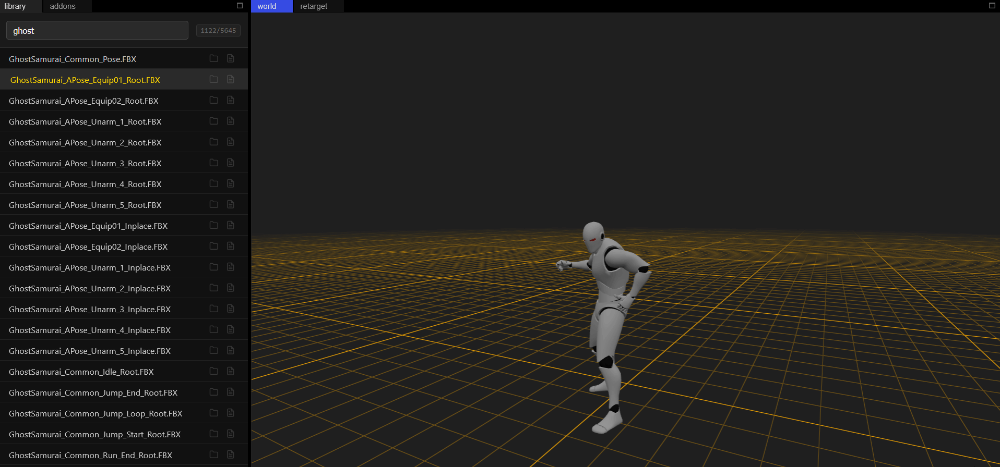
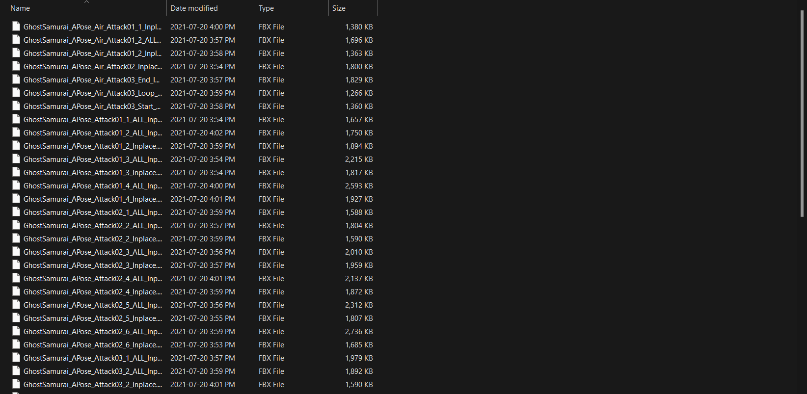
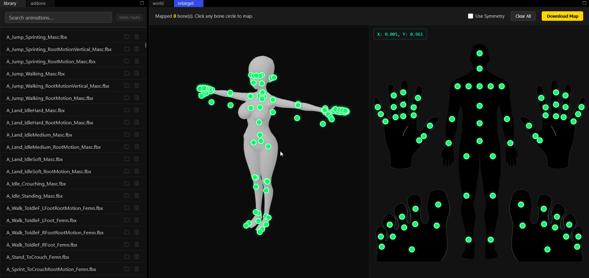

# Running
you can consult `package.json` for all commands.
to start only the webapp use `node run dev`
to start only the io server use `node run io`
to start both `node run full`

# Pics
animation previewing

original folder

retargeting
